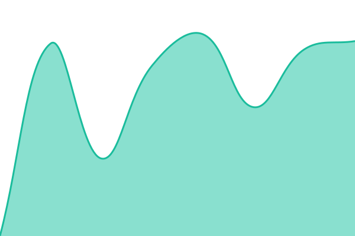

# [📈 Live Status](https://m-srl.github.io/uptime-monitor): <!--live status--> **Toate serviciile functioneaza corect**

This repository contains the open-source uptime monitor and status page for [m-srl](https://m-srl.github.io/uptime-monitor), powered by [Upptime](https://github.com/upptime/upptime).

With [Upptime](https://upptime.js.org), you can get your own unlimited and free uptime monitor and status page, powered entirely by a GitHub repository. We use [Issues](https://github.com/m-srl/uptime-monitor/issues) as incident reports, [Actions](https://github.com/m-srl/uptime-monitor/actions) as uptime monitors, and [Pages](https://m-srl.github.io/uptime-monitor) for the status page.

<!--start: status pages-->
<!-- This summary is generated by Upptime (https://github.com/upptime/upptime) -->
<!-- Do not edit this manually, your changes will be overwritten -->
<!-- prettier-ignore -->
| URL | Status | History | Timp raspuns | Uptime |
| --- | ------ | ------- | ------------- | ------ |
|  [Pegasus](https://pegasusit.ro) | 🟩 Up | [pegasus.yml](https://github.com/m-srl/uptime-monitor/commits/HEAD/history/pegasus.yml) | 

 825ms
     
 | 

<a href="https://m-srl.github.io/uptime-monitor/history/pegasus">99.12%</a>
    

|  [Pegasus - Health](https://status.pegasusit.ro/health) | 🟩 Up | [pegasus-health.yml](https://github.com/m-srl/uptime-monitor/commits/HEAD/history/pegasus-health.yml) | 

 682ms
     
 | 

<a href="https://m-srl.github.io/uptime-monitor/history/pegasus-health">100.00%</a>
    

|  [Pegasus - Proprietati](https://pegasusit.ro/proprietati) | 🟩 Up | [pegasus-proprietati.yml](https://github.com/m-srl/uptime-monitor/commits/HEAD/history/pegasus-proprietati.yml) | 

 761ms
     
 | 

<a href="https://m-srl.github.io/uptime-monitor/history/pegasus-proprietati">99.12%</a>
    

<!--end: status pages-->

[**Visit our status website →**](https://m-srl.github.io/uptime-monitor)

## 📄 License

- Powered by: [Upptime](https://github.com/upptime/upptime)
- Code: [MIT](./LICENSE) © [Anand Chowdhary](https://anandchowdhary.com), supported by [Pabio](https://pabio.com)
- Data in the `./history` directory: [Open Database License](https://opendatacommons.org/licenses/odbl/1-0/)
